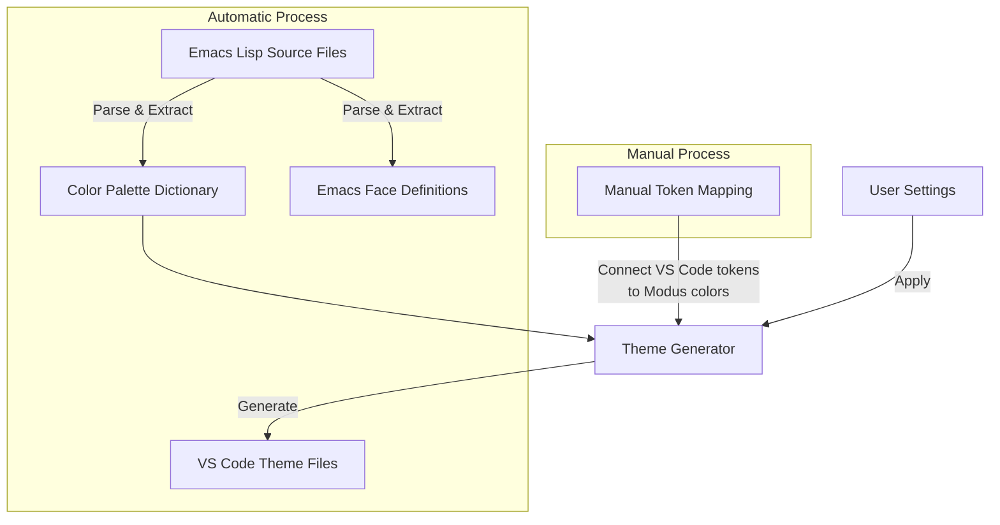

# Modus

> *Bringing Protesilaos Stavrou's acclaimed Emacs themes to Visual Studio Code*


## What makes Modus special?

Modus themes are built on principles of accessibility and thoughtful design:

- ✨ **Perfect clarity** with 7:1+ contrast ratios (WCAG AAA compliant)
- 🌈 **Inclusive design** with variants for different color vision needs
- 🎨 **Thoughtful aesthetics** that maintain readability without sacrificing beauty
- 🔄 **Consistent patterns** that help you understand code at a glance

## Theme Family

Choose the theme that works best for you:

| Theme | Mood | Best for |
|-------|------|----------|
| **Modus Operandi** | Bright & clear | Daytime coding, bright environments |
| **Modus Vivendi** | Deep & focused | Evening sessions, reduced glare |
| **Tinted variants** | Warm & gentle | Extended use, reduced eye strain |
| **Deuteranopia variants** | Optimized | Red-green color vision differences |
| **Tritanopia variants** | Optimized | Blue-yellow color vision differences |

Each theme maintains the same commitment to accessibility while offering a unique character to suit your preferences and needs.

## Getting Started

### Installation

```
Ctrl+P → ext install modus
```

Or download from the [releases page](https://github.com/wroyca/modus/releases/latest) and install manually.

### Selecting Your Theme

1. Press `Ctrl+K` then `Ctrl+T` (or `Cmd+K` then `Cmd+T` on macOS)
2. Type "Modus" to filter the theme list
3. Select your preferred variant

## Make It Yours

Customize your Modus experience with these settings:

```json
{
  "modus.boldKeywords": false,    // Add emphasis to keywords
  "modus.italicComments": true,   // Give comments a distinct style
  "modus.colorOverrides": {}      // Your personal color adjustments
}
```

After changing settings, run `Modus Themes: Reload Window to Apply Changes` for them to take effect.

## Behind the Scenes

Curious how Modus brings Emacs themes to VS Code? Here's a simplified view:



## With Gratitude

This project wouldn't exist without [Protesilaos Stavrou](https://protesilaos.com/), who created the [original Modus themes](https://protesilaos.com/emacs/modus-themes) for Emacs. We do our best to honor the principles and attention to detail that make the original themes so special.
