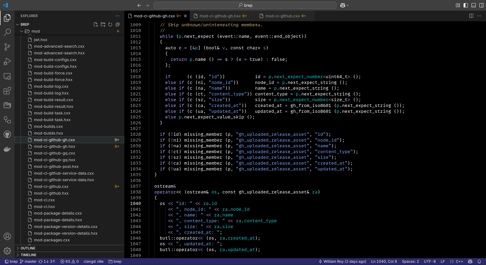
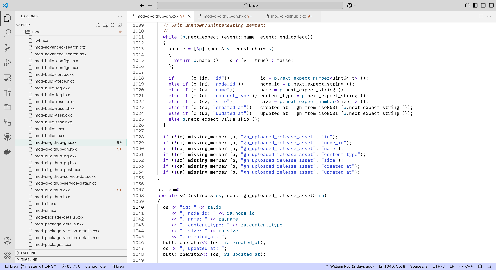
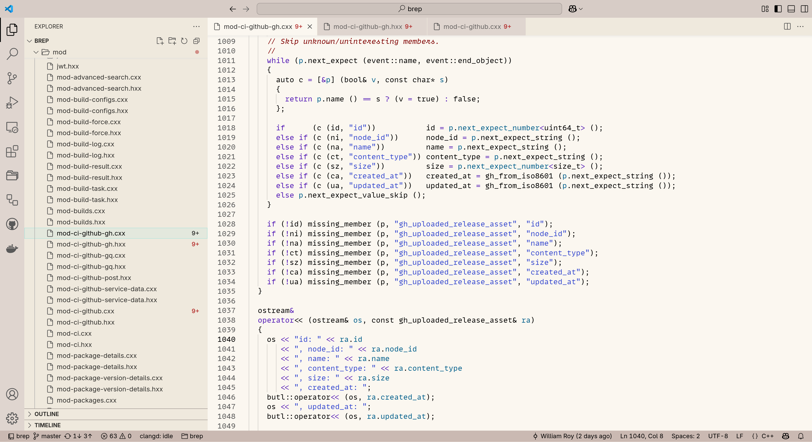

# Modus themes for Visual Studio Code

> This project brings Protesilaos Stavrou's Modus themes from GNU Emacs to Visual Studio Code.









## Overview

Modus themes are designed for accessible readability. They conform with the highest standard for color contrast between combinations of background and foreground values. This corresponds to the WCAG AAA standard, which specifies a minimum contrast ratio of 7:1. This implementation for Visual Studio Code aims to adapt the original themes on a best effort basis while accounting for the different semantic token models and interface elements of VS Code.

## Theme collection

The extension provides eight color themes, divided into four subgroups:

- **Main themes**: `Modus Operandi` (light) and `Modus Vivendi` (dark) are the project's primary themes. They are designed to cover a broad range of needs and serve as reference implementations for highly legible default themes.

- **Tinted themes**: `Modus Operandi Tinted` and `Modus Vivendi Tinted` are variants that slightly tone down the intensity of the background and provide more color variety. The light variant uses shades of light ochre (earthly colors), while the dark variant gives a night sky impression.

- **Deuteranopia themes**: `Modus Operandi Deuteranopia` and `Modus Vivendi Deuteranopia` are optimized for users with red-green color deficiency. They avoid using red and green hues for color-coding purposes, instead implementing colors that are discernible by users with deuteranopia or deuteranomaly (mostly yellow and blue hues).

- **Tritanopia themes**: `Modus Operandi Tritanopia` and `Modus Vivendi Tritanopia` are designed for users with blue-yellow color vision deficiency. They adapt the color palette to remain distinguishable for those with tritanopia or tritanomaly.

## Installation

### From VS Code Marketplace

1. Open VS Code
2. Access the Extensions view (`Ctrl+Shift+X` or `Cmd+Shift+X` on macOS)
3. Search for "Modus"
4. Select and install the extension

Alternatively, use the Quick Open command:
```
Ctrl+P → ext install wroyca.modus
```

### Manual installation

Download the VSIX file from the [releases page](https://github.com/wroyca/modus/releases/latest) and install it via:
```
code --install-extension modus-x.y.z.vsix
```
Where `x.y.z` represents the version number.

## Usage

### Activating a theme

1. Open the Command Palette (`Ctrl+Shift+P` or `Cmd+Shift+P` on macOS)
2. Type "Preferences: Color Theme" and select it
3. Select one of the Modus themes from the list

Alternatively, use the keyboard shortcut:
1. Press `Ctrl+K` then `Ctrl+T` (or `Cmd+K` then `Cmd+T` on macOS)
2. Select one of the Modus themes

### Customization

The extension provides several customization options:

#### Configuration settings

Add the following to your settings.json file to customize the theme behavior:

```json
{
  "modus.colorOverrides": {} // User-defined color overrides
}
```

#### Color overrides

You can override specific colors by adding entries to `modus.colorOverrides`:

```json
"modus.colorOverrides": {
  "editor.background": "#f5f5f5",
  "statusBar.background": "bg-alt"
}
```

The values can be:
- Hexadecimal color codes (e.g., `#f5f5f5`)
- Semantic color names from the Modus palette (e.g., `bg-alt`, `fg-main`)

#### Transparency support

Any color can be made transparent by appending an opacity value:

```json
"modus.colorOverrides": {
  "editor.selectionBackground": "bg-blue-subtle@0.5"  // 50% opacity
}
```

After changing configuration, run the "Modus Themes: Reload Window to Apply Changes" command for the changes to take effect.

## Implementation details

The themes are generated programmatically by:

1. Parsing the original Emacs Lisp source files to extract color palettes
2. Mapping appropriate colors to VS Code interface elements and token types
3. Generating theme JSON files with appropriate metadata


## References

- Official Modus themes documentation: <https://protesilaos.com/emacs/modus-themes>
- VS Code themes documentation: <https://code.visualstudio.com/api/extension-guides/color-theme>

## Acknowledgments

This project wouldn't exist without [Protesilaos Stavrou](https://protesilaos.com/), who created the [original Modus themes](https://protesilaos.com/emacs/modus-themes) for Emacs.

## License

This extension is distributed under the MIT license.
